# Laporan Praktikum 03 : Pengantar Bahasa Pemrograman Dart - Bagian 2

Nama : Yanuar Alda Baran <br>
NIM : 244107060016 <br>
Absen : 21 <br>

## Praktikum 1: Menerapkan Control Flows ("if/else")

### Langkah 1:
Ketik atau salin kode program berikut ke dalam fungsi main().
```dart
void main() {
String test = "test2";
if (test == "test1") {
  print("Test1");
} else if (test == "test2") {
  print("Test2");
} Else {
  print("Something else");
}

if (test == "test2") print("Test2 again");
}
```

### Langkah 2:
silakan coba eksekusi (Run) kode pada langkah 1 tersebut. Apa yang terjadi? Jelaskan!

jawaban:

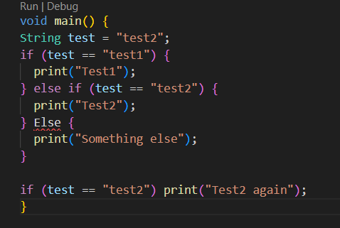

### penjelasan:
kode pada langkah 1 mengalami eror saat di eksekusi karena keyword if else menggunakan huruf kapital

berikut kode yang sudah di perbaiki : 
```dart
void main() {
String test = "test2";
if (test == "test1") {
  print("Test1");
} else if (test == "test2") {
  print("Test2");
} else {
  print("Something else");
}

if (test == "test2") print("Test2 again");
}
```
output:


### Langkah 3
Tambahkan kode program berikut, lalu coba eksekusi (Run) kode Anda.
```dart
String test = "true";
if (test) {
   print("Kebenaran");
}
```
jawaban:
Kode tersebut mengalami dua error. Pertama, variabel **test** sudah dideklarasikan sebelumnya sehingga terjadi redeclaration error. Kedua, kondisi **if** di Dart hanya menerima nilai bertipe **bool**, sedangkan **test** bertipe **String**, karena Dart tidak melakukan konversi otomatis dari String ke bool seperti pada JavaScript.

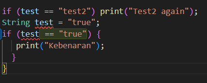

kode yang sudah di perbaiki :
``` dart 
String test2 = "true";
if (test2 == "true") {
   print("Kebenaran");
}
```
output yang di hasilkan:

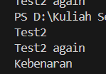

---

## Praktikum 2: Menerapkan Perulangan "while" dan "do-while"

### Langkah 1
Ketik atau salin kode program berikut ke dalam fungsi main().
```dart
void main() {
  while (counter < 33) {
    print(counter);
    counter++;
  }
}
```
### Langkah 2
Silakan coba eksekusi (Run) kode pada langkah 1 tersebut. Apa yang terjadi? Jelaskan! Lalu perbaiki jika terjadi error.

hasil eksekusi: 

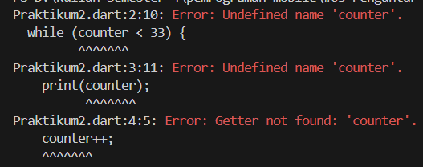

penjelasan:
Kode tersebut mengalami error karena variabel **counter** belum dideklarasikan. Dalam Dart, setiap variabel harus dideklarasikan terlebih dahulu dan diberi nilai awal agar perulangan **while** dapat berjalan.

berikut kode yang sudah di perbaiki : 
```dart
void main() {
  int counter = 0;
  while (counter < 33) {
    print(counter);
    counter++;
  }
}
```
output: 

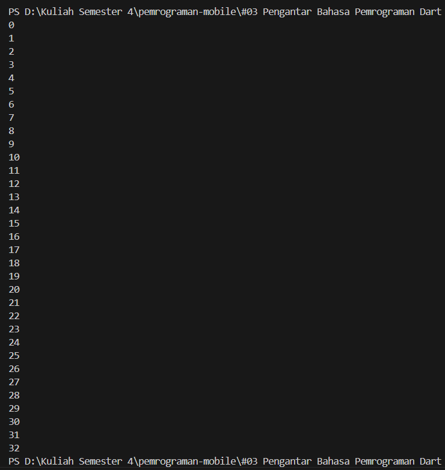

### Langkah 3
Tambahkan kode program berikut, lalu coba eksekusi (Run) kode Anda.
```dart
do {
  print(counter);
  counter++;
} while (counter < 77);
```

jawaban: 
Pada perulangan **do-while**, nilai **counter** melanjutkan dari hasil akhir perulangan **while**, yaitu 33, sehingga perulangan berjalan dari 33 hingga 76.

output:

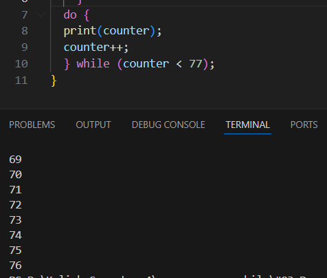

---

## Praktikum 3: Menerapkan Perulangan "for" dan "break-continue"

### Langkah 1
Ketik atau salin kode program berikut ke dalam fungsi main().
```dart
void main() {
  for (Index = 10; index < 27; index) {
    print(Index);
  }
}
```
### Langkah 2
Silakan coba eksekusi (Run) kode pada langkah 1 tersebut. Apa yang terjadi? Jelaskan! Lalu perbaiki jika terjadi error.

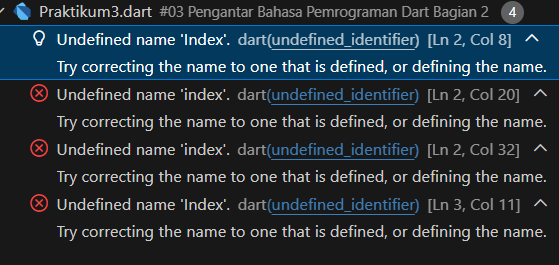


Penjelasan:
Kode tersebut mengalami beberapa error karena penggunaan variabel **Index** dan **index** tidak konsisten (Dart bersifat *case sensitive*), variabel **index** belum dideklarasikan, serta tidak terdapat **increment (`index++`)** yang menyebabkan perulangan menjadi *infinite loop*.

Berikut kode yang sudah diperbaiki:
```dart
void main() {
  for (int index = 10; index < 27; index++) {
    print(index);
  }
}
```
output : 

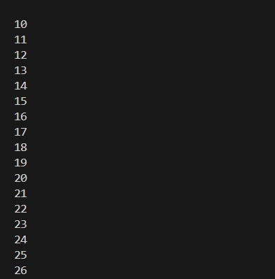

### Langkah 3
Tambahkan kode program berikut di dalam for-loop, lalu coba eksekusi (Run) kode Anda.
```dart
If (Index == 21) break;
Else If (index > 1 || index < 7) continue;
print(index);
```

Apa yang terjadi ? Jika terjadi error, silakan perbaiki namun tetap menggunakan for dan break-continue


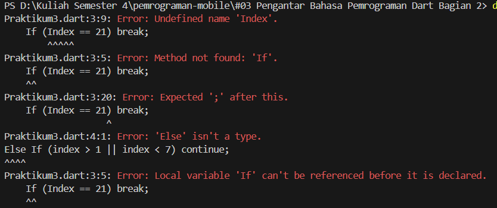

Penjelasan:
Kode tersebut mengalami error karena penulisan **If** dan **Else If** menggunakan huruf kapital (seharusnya *if* dan *else if*), serta penggunaan variabel **Index** tidak konsisten dengan **index** yang telah dideklarasikan.

berikut kode lengkap yang sudah di perbaiki: 
```dart
void main() {
  for (int index = 10; index < 27; index++) {
    if (index == 21) break;
    else if (index > 1 || index < 7) continue;
    print(index);
  }
}
```
penjelasan:
Kondisi index > 1 || index < 7 selalu bernilai true, sehingga continue selalu dijalankan dan print(index) tidak pernah dieksekusi. Perulangan berhenti saat index == 21 karena break

output:

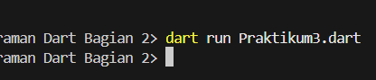

## Tugas: Buatlah sebuah program yang dapat menampilkan bilangan prima dari angka 0 sampai 201 menggunakan Dart. Ketika bilangan prima ditemukan, maka tampilkan nama lengkap dan NIM Anda.

jawaban: 
```dart
void main() {
  String nama = "Yanuar Alda Baran";
  String nim = "244107060016";

  for (int i = 0; i <= 201; i++) {
    bool isPrima = true;

    for (int j = 2; j * j <= i; j++) {
      if (i % j == 0) {
        isPrima = false;
        break;
      }
    }

    if (isPrima) {
      print("$i : Nama: $nama, NIM: $nim");
    } else {
      print("$i");
    }
  }
}
```

output:

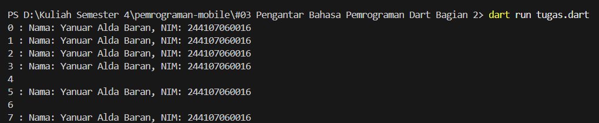