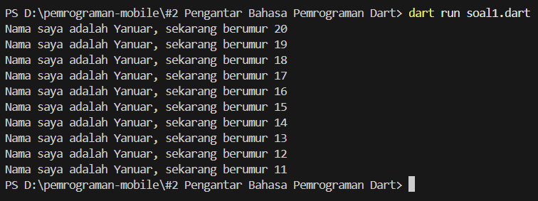

# Laporan Praktikum 02 : Pengantar Bahasa Pemrograman Dart

Nama : Yanuar Alda Baran <br>
NIM : 244107060016 <br>
Absen : 21 <br>

## soal 1
Ubahlah bagian kode pada baris ke-3 berikut agar menghasilkan output sesuai dengan ketentuan pada soal!

```dart
void main() {
  for (int i = 0; i < 10; i++) {
    print("Hello ${i + 2}");
  }
}
```
## jawaban

```dart
void main() {
  for (int i = 0; i < 10; i++) {
    print('Nama saya adalah Yanuar, sekarang berumur ${20 - i}');
  }
}
```


## soal 2
Mengapa pemahaman terhadap bahasa Dart menjadi hal yang penting sebelum mempelajari dan menggunakan framework Flutter?

## jawaban
Pemahaman bahasa Dart sangat penting karena Flutter dibangun sepenuhnya menggunakan bahasa pemrograman Dart. Seluruh proses pembuatan aplikasi, mulai dari logika program hingga tampilan antarmuka (UI), ditulis menggunakan Dart.

Dengan menguasai dasar-dasar Dart, proses belajar Flutter akan menjadi lebih mudah. Kita dapat memahami struktur kode, cara kerja widget, serta mengelola logika aplikasi dengan lebih baik. Selain itu, pemahaman terhadap konsep seperti variabel, fungsi, percabangan, perulangan, dan Object-Oriented Programming (OOP) akan membantu dalam menulis kode yang lebih terstruktur dan efisien.

Tanpa memahami Dart terlebih dahulu, penggunaan Flutter akan terasa sulit karena belum memahami fondasi bahasa yang digunakan.

## Soal 3
Buatlah ringkasan materi penting dari codelab yang dapat membantu dalam proses pengembangan aplikasi mobile menggunakan Flutter.

## jawaban 
Berikut beberapa poin penting dari materi codelab yang mendukung pengembangan aplikasi menggunakan Flutter:

1. Dart sebagai Dasar Pengembangan Flutter
Dart merupakan bahasa utama yang digunakan dalam Flutter. Semua komponen aplikasi, baik logika maupun tampilan, ditulis menggunakan Dart sehingga pemahaman dasar bahasa ini menjadi hal yang wajib.

2. Keunggulan Dart
Dart memiliki sintaks yang mudah dipahami, mendukung OOP, serta memiliki performa yang baik. Hal ini membuat Dart cocok digunakan untuk pengembangan aplikasi mobile lintas platform.

3. Sistem Kompilasi Dart
Dart memiliki dua metode kompilasi:
JIT (Just In Time) yang mendukung fitur hot reload sehingga perubahan kode dapat langsung terlihat saat pengembangan.

AOT (Ahead Of Time) yang mengubah kode menjadi native saat aplikasi dirilis sehingga performanya lebih optimal.

4. Konsep Object-Oriented Programming (OOP)
Dart menerapkan konsep OOP seperti:
- Class dan Object
- Encapsulation
- Inheritance
- Method dan Property
- Konsep ini penting karena Flutter menggunakan pendekatan berbasis class dalam pembuatan widget.

5. Dasar Sintaks dan Operator
Beberapa elemen dasar dalam Dart yang perlu dipahami antara lain:
- Operator aritmatika (+, -, *, /, %)
- Operator perbandingan (==, !=, >, <)
- Operator logika (&&, ||, !)
- Increment dan decrement (++, --)
Pemahaman dasar ini membantu dalam membangun logika aplikasi dengan baik dan benar.

## soal 4
Jelaskan perbedaan antara Null Safety dan Late Variable beserta contoh kode dan hasil eksekusinya.

## jawaban
1. Null Safety

Null Safety adalah fitur pada Dart yang mencegah variabel memiliki nilai null secara tidak sengaja. Variabel harus memiliki nilai yang jelas, kecuali secara eksplisit diperbolehkan bernilai null.

contoh kode:
```dart
void main() {
  String? prodi;
  print(prodi);
}
```


## Penjelasan:
- String tanpa tanda ? tidak boleh bernilai null.
- String? berarti variabel diperbolehkan bernilai null.
- Jika variabel non-nullable diisi null, maka akan terjadi compile-time error.

2. Late Variable
late digunakan ketika variabel ingin dideklarasikan terlebih dahulu dan akan diinisialisasi kemudian sebelum digunakan.

```dart
void main() {
  late String jurusan;

  jurusan = "Teknologi Informasi";
  print(jurusan);
} 
```


## penjelasan
Penjelasan:
- Variabel tidak langsung diberi nilai saat deklarasi.
- Nilai harus diberikan sebelum variabel digunakan.
- Jika variabel digunakan sebelum diinisialisasi, akan terjadi runtime error.