# Laporan Praktikum 04 : Pengantar Bahasa Pemrograman Dart - Bagian 2

Nama : Yanuar Alda Baran <br>
NIM : 244107060016 <br>
Absen : 21 <br>

## Praktikum 1: Eksperimen Tipe Data List

### Langkah 1 

Ketik atau salin kode program berikut ke dalam void main().

```dart
 void main() {
   var list = [1, 2, 3];
   assert(list.length == 3);
   assert(list[1] == 2);
   print(list.length);
   print(list[1]);

   list[1] = 1;
   assert(list[1] == 1);
   print(list[1]);
 }
```

### Langkah 2

hasil eksekusi

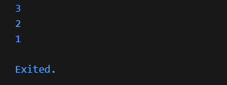

penjelasan:
Kode pada langkah 1 berhasil dijalankan tanpa error. Program membuat sebuah List berisi tiga angka [1, 2, 3]. Perintah assert(list.length == 3) memastikan bahwa jumlah elemen dalam list adalah 3. Kemudian assert(list[1] == 2) memeriksa bahwa nilai pada indeks ke-1 adalah 2, dan kondisi ini benar. Setelah itu program mencetak panjang list (3) dan nilai elemen indeks ke-1 (2). Selanjutnya nilai pada indeks ke-1 diubah menjadi 1 dengan list[1] = 1. Perintah assert(list[1] == 1) memastikan perubahan tersebut berhasil. Terakhir, program mencetak nilai baru pada indeks ke-1 yaitu 1.

### Langkah 3 

Ubah kode pada langkah 1 menjadi variabel final yang mempunyai index = 5 dengan default value = null. Isilah nama dan NIM Anda pada elemen index ke-1 dan ke-2. Lalu print dan capture hasilnya.

Apa yang terjadi ? Jika terjadi error, silakan perbaiki.

Jawaban: 

ketika di run mengalami eror seperti di bawah ini 
Hal ini terjadi karena `List.filled(5, null)` dibuat tanpa menentukan tipe data. Akibatnya Dart menganggap list tersebut bertipe **List<Null>**, sehingga hanya bisa menyimpan nilai **null**. Ketika list tersebut diisi dengan **String**, Dart menolak karena tipe datanya tidak sesuai.

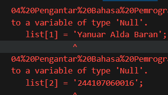

Berikut kode yang sudah diperbaiki:

```dart
void main() {
  final List<String?> list = List.filled(5, null);
  assert(list.length == 5);
  assert(list[1] == null);
  print(list.length);
  print(list[1]);

  list[1] = 'Yanuar Alda Baran';
  list[2] = '244107060016';
  assert(list[1] == 'Yanuar Alda Baran');
  assert(list[2] == '244107060016');
  print(list[1]);
  print(list[2]);
}
```
output ketika sudah diperbaiki 
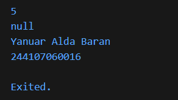
penjelasan: 
Dengan menentukan tipe secara eksplisit, Dart mengetahui bahwa list dapat menyimpan nilai **String** maupun **null**, sehingga pengisian String tidak menimbulkan error.

Tipe yang dapat digunakan antara lain:

* **List<String?>**: digunakan jika elemen hanya berupa **String** atau **null**. Ini adalah tipe yang paling sesuai untuk kasus ini.
* **List<Object?>**: digunakan jika elemen bisa berisi berbagai tipe data (seperti **int, String**, dll.) atau **null**, karena **Object** merupakan tipe dasar semua objek di Dart.

---

## Praktikum 2: Eksperimen Tipe Data Set

### Langkah 1

Ketik atau salin kode program berikut ke dalam fungsi main().

```dart
void main() {
  var halogens = {'fluorine', 'chlorine', 'bromine', 'iodine', 'astatine'};
  print(halogens);
}
```
### Langkah 2

Silakan coba eksekusi (Run) kode pada langkah 1 tersebut. Apa yang terjadi? Jelaskan! Lalu perbaiki jika terjadi error.

hasil run: 

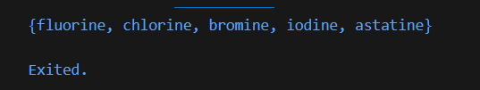

penjelasan: 
ketika di run  tidak ada error sama sekali. Dart mengenali {'fluorine', 'chlorine', 'bromine', 'iodine', 'astatine'} sebagai sebuah Set, bukan Map. 

### Langkah 3

Tambahkan kode program berikut, lalu coba eksekusi (Run) kode Anda.

```dart
var names1 = <String>{};
Set<String> names2 = {}; 
var names3 = {}; 

print(names1);
print(names2);
print(names3);
```
jawaban: 
Kode awal berjalan tanpa error, tetapi ketiga variabel memiliki perbedaan:

* `var names1 = <String>{};` membuat **Set kosong bertipe `Set<String>`** dengan penulisan tipe langsung.
* `Set<String> names2 = {};` juga membuat **Set kosong bertipe `Set<String>`**, tetapi tipe ditulis pada deklarasi variabel.
* `var names3 = {};` bukan **Set**, melainkan **Map kosong (`Map<dynamic, dynamic>`)** karena Dart menganggap `{}` tanpa tipe sebagai Map.

Pada instruksi, `names3` dihapus. Kemudian **nama dan NIM** ditambahkan ke `names1` menggunakan `.add()` dan ke `names2` menggunakan `.addAll()`.

```dart 
void main() {
  var names1 = <String>{};
  Set<String> names2 = {};

  names1.add('Yanuar Alda Baran');
  names1.add('244107060016');

  names2.addAll(['Yanuar Alda Baran', '244107060016']);

  print("ini names1");
  print(names1);
  print("ini names2");
  print(names2);
}
```
output: 

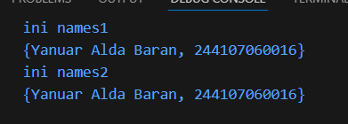

---

## Praktikum 3: Eksperimen Tipe Data Maps

### Langkah 1

Ketik atau salin kode program berikut ke dalam fungsi main().

```dart
void main() {
  var gifts = {
    // Key:    Value
    'first': 'partridge',
    'second': 'turtledoves',
    'fifth': 1
  };

  var nobleGases = {
    2: 'helium',
    10: 'neon',
    18: 2,
  };

  print(gifts);
  print(nobleGases);
}
```
### Langkah 2

Silakan coba eksekusi (Run) kode pada langkah 1 tersebut. Apa yang terjadi? Jelaskan! Lalu perbaiki jika terjadi error.

penjelasan:
Saat kode dijalankan tidak muncul error, tetapi ada hal penting yang perlu diperhatikan. Dart mengenali `{key: value}` sebagai **Map**, dan tipe Map ditentukan dari isi datanya.

Pada variabel `gifts`, semua **key bertipe String**, tetapi **value bercampur** antara `String` (`'partridge'`) dan `int` (`1`). Karena ada dua tipe berbeda, Dart menginferensi tipe menjadi **Map<String, Object>**, bukan **Map<String, String>**.

Hal yang sama terjadi pada `nobleGases`, di mana **key bertipe int** dan **value campuran String dan int**, sehingga tipenya menjadi **Map<int, Object>**.

output yang di hasilkan: 

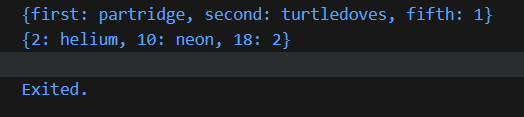

### Langkah 3

Tambahkan kode program berikut, lalu coba eksekusi (Run) kode Anda.

```dart
var mhs1 = Map<String, String>();
gifts['first'] = 'partridge';
gifts['second'] = 'turtledoves';
gifts['fifth'] = 'golden rings';

var mhs2 = Map<int, String>();
nobleGases[2] = 'helium';
nobleGases[10] = 'neon';
nobleGases[18] = 'argon';
```
Apa yang terjadi ? Jika terjadi error, silakan perbaiki. Tambahkan elemen nama dan NIM Anda pada tiap variabel di atas (gifts, nobleGases, mhs1, dan mhs2).

Kode berjalan tanpa error. Nilai `gifts['fifth']` diubah dari **1 (int)** menjadi **'golden rings' (String)**, dan `nobleGases[18]` dari **2 (int)** menjadi **'argon' (String)**. Hal ini tetap valid karena tipe Map sudah diinferensi sebagai **Map<String, Object>** dan **Map<int, Object>**, sehingga dapat menyimpan beberapa tipe data.

Variabel `mhs1` dan `mhs2` dibuat menggunakan konstruktor `Map<K, V>()`, yaitu cara lain membuat Map selain menggunakan literal. Dengan menentukan tipe **key** dan **value** secara eksplisit, Map menjadi lebih aman dibandingkan tipe yang diinferensi otomatis dari data campuran.

output: 

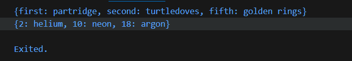

Berikut kode lengkap setelah ditambahkan nama dan NIM:

```dart
void main() {
  var gifts = {
    // Key:    Value
    'first': 'partridge',
    'second': 'turtledoves',
    'fifth': 1,
    'nama': 'Yanuar Alda Baran',
    'nim': '244107060016',
  };

  var nobleGases = {
    2: 'helium',
    10: 'neon',
    18: 'argon',
    'nama': 'Yanuar Alda Baran',
    'nim': '244107060016',
  };

  gifts['first'] = 'partridge';
  gifts['second'] = 'turtledoves';
  gifts['fifth'] = 'golden rings';

  nobleGases[2] = 'helium';
  nobleGases[10] = 'neon';
  nobleGases[18] = 'argon';

  var mhs1 = Map<String, String>();
  mhs1['nama'] = "Yanuar Alda Baran";
  mhs1['nim'] = "244107060016";

  var mhs2 = Map<int, String>();
  mhs2[1] = "Yanuar Alda Baran";
  mhs2[2] = "244107060016";

  print("ini variabel gifts");
  print(gifts);
  print("ini variabel nobleGases");
  print(nobleGases);
  print("ini variabel mhs1");
  print(mhs1);
  print("ini variabel mhs2");
  print(mhs2);
}
```
output:
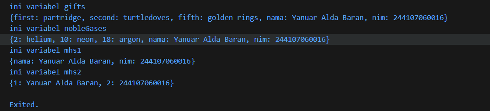

---

## Praktikum 4: Eksperimen Tipe Data List: Spread dan Control-flow Operators

### Langkah 1

Ketik atau salin kode program berikut ke dalam fungsi main().

```dart
var list = [1, 2, 3];
var list2 = [0, ...list];
print(list1);
print(list2);
print(list2.length);
```
### Langkah 2

Silakan coba eksekusi (Run) kode pada langkah 1 tersebut. Apa yang terjadi? Jelaskan! Lalu perbaiki jika terjadi error.

jawaban: 

output ketika di run
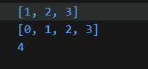

penjelasan:
Kode tersebut membuat sebuah list [1, 2, 3] yang disimpan pada variabel list.
Kemudian dibuat list2 dengan isi [0, ...list]. Tanda ... disebut spread operator, yang berfungsi menyalin semua elemen dari list ke dalam list2.

Akibatnya:
list berisi [1, 2, 3]
list2 berisi [0, 1, 2, 3]
Program kemudian mencetak isi list, isi list2, dan panjang list2 yang bernilai 4.

### Langkah 3

Tambahkan kode program berikut, lalu coba eksekusi (Run) kode Anda.

```dart
list1 = [1, 2, null];
print(list1);
var list3 = [0, ...?list1];
print(list3.length);
```
Apa yang terjadi ? Jika terjadi error, silakan perbaiki. Tambahkan variabel list berisi NIM Anda menggunakan Spread Operators.

```dart
void main() {
  var list = [1, 2, 3];
  var list2 = [0, ...list];
  print(list);
  print(list2);
  print(list2.length);

  var list1 = [1, 2, null];
  print(list1);
  var list3 = [0, ...?list1];
  print(list3.length);

  // Tambah NIM menggunakan Spread Operator
  var charNIM = [2, 4, 4, 1, 0, 7, 0, 6, 0, 0, 1, 6];
  var nim = [...charNIM];
  print(nim);
}
```
tidak terjadi eror outputnya seperti di bawah ini:

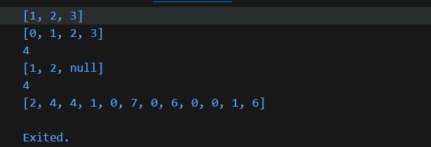

### langkah 4

Tambahkan kode program berikut, lalu coba eksekusi (Run) kode Anda.
```dart
var nav = ['Home', 'Furniture', 'Plants', if (promoActive) 'Outlet'];
print(nav);
```
Apa yang terjadi ? Jika terjadi error, silakan perbaiki. Tunjukkan hasilnya jika variabel promoActive ketika true dan false.

eror karena promoActive belum di deklarasikan

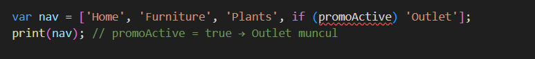

output setelah di deklarasikan setelah di deklarasikan:

true:

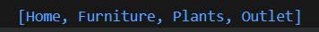

false: 

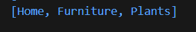

### Langkah 5

Tambahkan kode program berikut, lalu coba eksekusi (Run) kode Anda.
```dart
var nav2 = ['Home', 'Furniture', 'Plants', if (login case 'Manager') 'Inventory'];
print(nav2);
```

output login = manager: 


output login = staff:

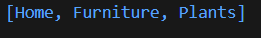

### Langkah 6

Tambahkan kode program berikut, lalu coba eksekusi (Run) kode Anda.

tidak terjadi eror

```dart
var listOfInts = [1, 2, 3];
var listOfStrings = ['#0', for (var i in listOfInts) '#$i'];
assert(listOfStrings[1] == '#1');
print(listOfStrings);
```

output:
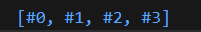

---

## Praktikum 5: Eksperimen Tipe Data Records

### Langkah 1

Ketik atau salin kode program berikut ke dalam fungsi main().

```dart
var record = ('first', a: 2, b: true, 'last');
print(record)
```

### Langkah 2
Silakan coba eksekusi (Run) kode pada langkah 1 tersebut. Apa yang terjadi? Jelaskan! Lalu perbaiki jika terjadi error.

eror ketika di run karena tidak ada (;) berikut hasil setelah di perbaiki

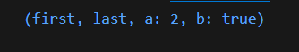

### Langkah 3

Tambahkan kode program berikut di luar scope void main(), lalu coba eksekusi (Run) kode Anda.
```dart
(int, int) tukar((int, int) record) {
  var (a, b) = record;
  return (b, a);
}
```
output langkah 3:

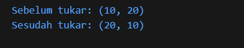

### Langkah 4 

Tambahkan kode program berikut di dalam scope void main(), lalu coba eksekusi (Run) kode Anda

```dart
// Record type annotation in a variable declaration:
(String, int) mahasiswa;
print(mahasiswa);
```
jawaban :
kode eror karena variabel mahasiswa dideklarasikan tapi belum diinisialisasi.

output setelah diperbaiki:

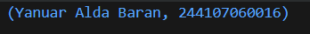

### Langkah 5

Tambahkan kode program berikut di dalam scope void main(), lalu coba eksekusi (Run) kode Anda.

```dart
var mahasiswa2 = ('first', a: 2, b: true, 'last');

print(mahasiswa2.$1); // Prints 'first'
print(mahasiswa2.a);  // Prints 2
print(mahasiswa2.b);  // Prints true
print(mahasiswa2.$2); // Prints 'last'
```

output :

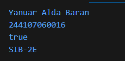

---

# Tugas Praktikum

### 1. Silakan selesaikan Praktikum 1 sampai 5, lalu dokumentasikan berupa screenshot hasil pekerjaan Anda beserta penjelasannya!

sudah dilakuan di bagian atas 

### 2. Jelaskan yang dimaksud Functions dalam bahasa Dart!
Function adalah blok kode yang digunakan untuk menjalankan suatu tugas tertentu. Function dapat dipanggil berulang kali sehingga program menjadi lebih terstruktur, mudah dibaca, dan tidak perlu menulis kode yang sama berulang.

### 3. Jelaskan jenis-jenis parameter di Functions beserta contoh sintaksnya!
1. Required Parameter

Parameter yang wajib diisi saat function dipanggil.
```dart
void sapa(String nama) {
  print("Halo $nama");
}

void main() {
  sapa("Dimas");
}
```

2. Optional Positional Parameter

Parameter tidak wajib dan ditulis dalam tanda [ ].
```dart
void sapa(String nama, [String? pesan]) {
  print("Halo $nama");
  print(pesan);
}

void main() {
  sapa("Dimas");
}
```

3. Named Parameter

Parameter menggunakan nama variabel saat dipanggil dan ditulis dalam { }.
```dart
void sapa({String? nama, int? umur}) {
  print("Nama: $nama");
  print("Umur: $umur");
}

void main() {
  sapa(nama: "Dimas", umur: 20);
}
```

4. Default Parameter

Parameter memiliki nilai default jika tidak diisi.
```dart
void sapa(String nama, {String pesan = "Selamat datang"}) {
  print("$pesan $nama");
}

void main() {
  sapa("Dimas");
}
```

### 4. Jelaskan maksud Functions sebagai first-class objects beserta contoh sintaknya!
Di Dart, function dianggap sebagai objek sehingga bisa:
disimpan dalam variabel, dikirim sebagai parameter, dikembalikan dari function lain
```dart
int tambah(int a, int b) {
  return a + b;
}

void main() {
  var operasi = tambah;
  print(operasi(2, 3));
}
```
### 5. Apa itu Anonymous Functions? Jelaskan dan berikan contohnya!
5. Apa itu Anonymous Functions

Anonymous Function adalah function tanpa nama yang biasanya digunakan untuk operasi singkat atau sebagai parameter function lain.
```dart
void main() {
  var kali = (int a, int b) {
    return a * b;
  };

  print(kali(3, 4));
}
```
### 6. Jelaskan perbedaan Lexical scope dan Lexical closures! Berikan contohnya!
6. Perbedaan Lexical Scope dan Lexical Closures
Lexical Scope

Variabel dapat diakses berdasarkan lokasi penulisan kode.
```dart
void main() {
  var nama = "Yanuar";

  void tampil() {
    print(nama);
  }

  tampil();
}
```

Lexical Closure

Function mengingat variabel dari scope luar meskipun sudah keluar dari blok tersebut.
```dart
Function buatCounter() {
  int count = 0;

  return () {
    count++;
    return count;
  };
}

void main() {
  var counter = buatCounter();
  print(counter());
  print(counter());
}
```
output:
```dart
1
2
```

### 7. Jelaskan dengan contoh cara membuat return multiple value di Functions!
7. Cara membuat return multiple value di Functions

Di Dart bisa menggunakan Record untuk mengembalikan beberapa nilai sekaligus.
```dart
(int, int) tukar((int, int) data) {
  var (a, b) = data;
  return (b, a);
}

void main() {
  var hasil = tukar((10, 20));
  print(hasil);
}
```
output
```dart
(20,10)
```

