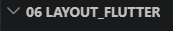
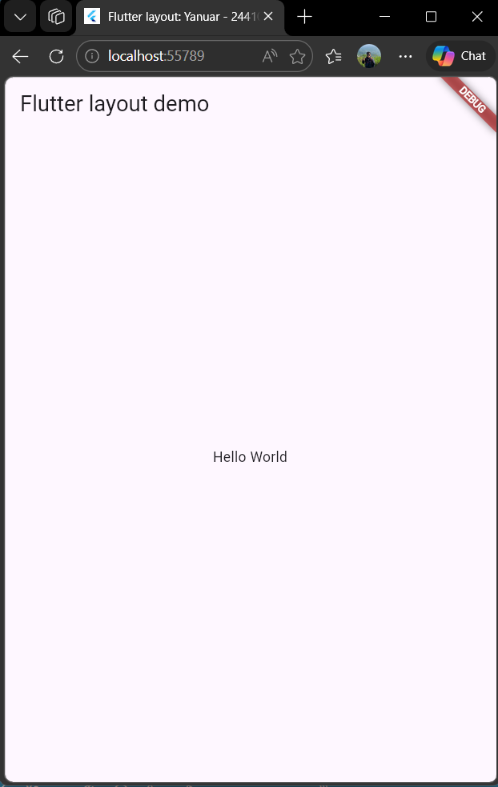
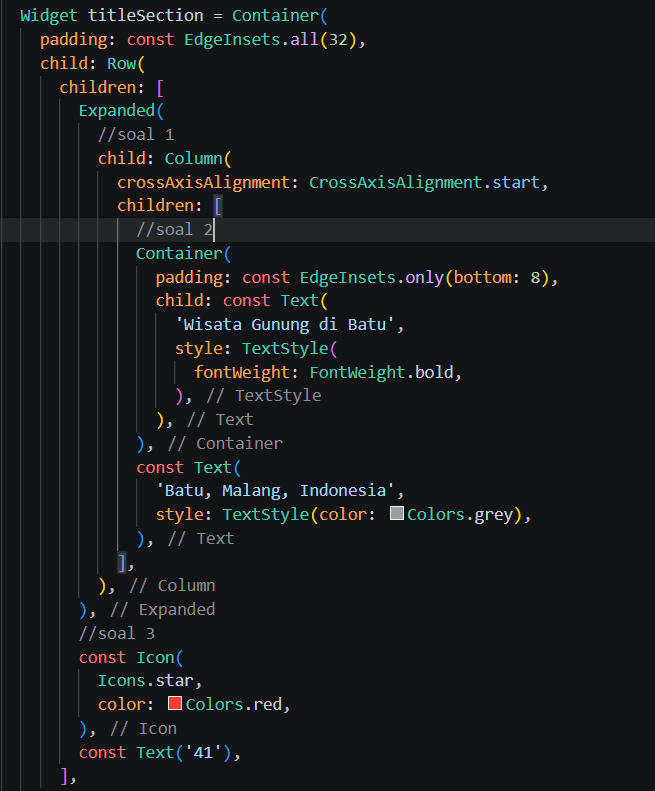

# Laporan Praktikum 06 : Aplikasi Pertama dan Widget Dasar Flutter

Nama : Yanuar Alda Baran <br>
NIM : 244107060016 <br>
Absen : 21 <br>

## Praktikum 1: Membangun Layout di Flutter

### Langkah 1: Buat Project Baru
Buatlah sebuah project flutter baru dengan nama layout_flutter. Atau sesuaikan style laporan praktikum yang Anda buat.



Langkah 2: Buka file lib/main.dart
Buka file main.dart lalu ganti dengan kode berikut. Isi nama dan NIM Anda di text title.

```dart
import 'package:flutter/material.dart';

void main() => runApp(const MyApp());

class MyApp extends StatelessWidget {
  const MyApp({super.key});

  @override
  Widget build(BuildContext context) {
    return MaterialApp(
      title: 'Flutter layout: Yanuar - 244107060016',
      home: Scaffold(
        appBar: AppBar(
          title: const Text('Flutter layout demo'),
        ),
        body: const Center(
          child: Text('Hello World'),
        ),
      ),
    );
  }
}
```

output:




### Langkah 3: Identifikasi layout diagram
Langkah pertama adalah memecah tata letak menjadi elemen dasarnya:

-Identifikasi baris dan kolom. Ada, Column utama + beberapa Row
-Apakah tata letaknya menyertakan kisi-kisi (grid)? Tidak ada grid
-Apakah ada elemen yang tumpang tindih? Tidak (semua tersusun rapi)
-Apakah UI memerlukan tab? Tidak ada
-Perhatikan area yang memerlukan alignment, padding, atau borders. 
Ada:
- Padding di teks
- Alignment di Row
- Spacing antar elemen

Pertama, identifikasi elemen yang lebih besar. Dalam contoh ini, empat elemen disusun menjadi sebuah kolom: sebuah gambar, dua baris, dan satu blok teks.

```dart
 children: [
            // 1. Gambar
            Image.network(
              'https://picsum.photos/600/240',
              width: double.infinity,
              height: 240,
              fit: BoxFit.cover,
            ),

            // 2. Judul + lokasi + rating
            Padding(
              padding: const EdgeInsets.all(16),
              child: Row(
                mainAxisAlignment: MainAxisAlignment.spaceBetween,
                children: [
                  Column(
                    crossAxisAlignment: CrossAxisAlignment.start,
                    children: const [
                      Text(
                        'Oeschinen Lake Campground',
                        style: TextStyle(
                          fontWeight: FontWeight.bold,
                        ),
                      ),
                      SizedBox(height: 4),
                      Text(
                        'Kandersteg, Switzerland',
                        style: TextStyle(color: Colors.grey),
                      ),
                    ],
                  ),
                  Row(
                    children: const [
                      Icon(Icons.star, color: Colors.red),
                      SizedBox(width: 4),
                      Text('41'),
                    ],
                  )
                ],
              ),
            ),

            // 3. Tombol
            Row(
              mainAxisAlignment: MainAxisAlignment.spaceEvenly,
              children: const [
                Column(
                  children: [
                    Icon(Icons.call, color: Colors.blue),
                    SizedBox(height: 4),
                    Text('CALL'),
                  ],
                ),
                Column(
                  children: [
                    Icon(Icons.near_me, color: Colors.blue),
                    SizedBox(height: 4),
                    Text('ROUTE'),
                  ],
                ),
                Column(
                  children: [
                    Icon(Icons.share, color: Colors.blue),
                    SizedBox(height: 4),
                    Text('SHARE'),
                  ],
                ),
              ],
            ),

            // 4. Deskripsi
            Padding(
              padding: const EdgeInsets.all(16),
              child: const Text(
                'Lake Oeschinen lies at the foot of the Blüemlisalp in the Bernese Alps. '
                'Situated 1,578 meters above sea level, it is one of the larger Alpine Lakes. '
                'A gondola ride from Kandersteg, followed by a half-hour walk through pastures '
                'and pine forest, leads you to the lake, which warms to 20 degrees Celsius in '
                'the summer. Activities enjoyed here include rowing, and riding the summer toboggan run.',
              ),
            ),
 ],
 ```
output:


### Langkah 4: Implementasi title row
Pertama, Anda akan membuat kolom bagian kiri pada judul. Tambahkan kode berikut di bagian atas metode build() di dalam kelas MyApp:
```dart
Widget titleSection = Container(
      padding: const EdgeInsets.all(32),
      child: Row(
        children: [
          Expanded(
            //soal 1
            child: Column(
              crossAxisAlignment: CrossAxisAlignment.start,
              children: [
                //soal 2
                Container(
                  padding: const EdgeInsets.only(bottom: 8),
                  child: const Text(
                    'Wisata Gunung di Batu',
                    style: TextStyle(
                      fontWeight: FontWeight.bold,
                    ),
                  ),
                ),
                const Text(
                  'Batu, Malang, Indonesia',
                  style: TextStyle(color: Colors.grey),
                ),
              ],
            ),
          ),
          //soal 3
          const Icon(
            Icons.star,
            color: Colors.red,
          ),
         ],
      ),
    );

```

Penjelasan Soal:
Soal 1: Letakkan widget Column di dalam widget Expanded agar menyesuaikan ruang yang tersisa di dalam widget Row. Tambahkan properti crossAxisAlignment ke CrossAxisAlignment.start sehingga posisi kolom berada di awal baris.
Soal 2: Letakkan baris pertama teks di dalam Container sehingga memungkinkan Anda untuk menambahkan padding = 8. Teks ‘Batu, Malang, Indonesia' di dalam Column, set warna menjadi abu-abu.
Soal 3: Dua item terakhir di baris judul adalah ikon bintang, set dengan warna merah, dan teks "41". Seluruh baris ada di dalam Container dan beri padding di sepanjang setiap tepinya sebesar 32 piksel. Kemudian ganti isi body text ‘Hello World' dengan variabel titleSection.



## Praktikum 2: Implementasi button row
Selesaikan langkah-langkah praktikum berikut ini dengan melanjutkan dari praktikum sebelumnya.

### Langkah 1: Buat method Column _buildButtonColumn
Bagian tombol berisi 3 kolom yang menggunakan tata letak yang sama—sebuah ikon di atas baris teks. Kolom pada baris ini diberi jarak yang sama, dan teks serta ikon diberi warna primer.

Karena kode untuk membangun setiap kolom hampir sama, buatlah metode pembantu pribadi bernama buildButtonColumn(), yang mempunyai parameter warna, IconData dan String label, sehingga dapat mengembalikan kolom dengan widgetnya sesuai dengan warna tertentu.

