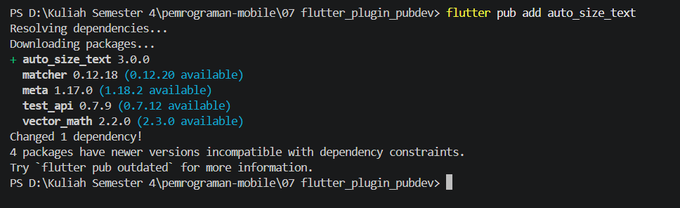
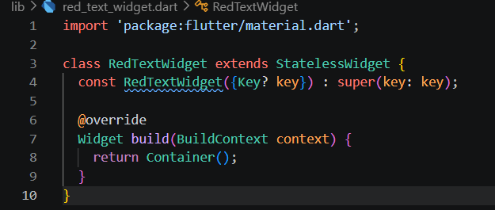
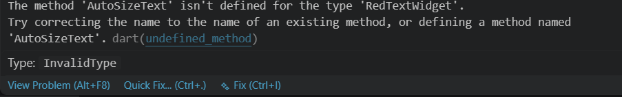
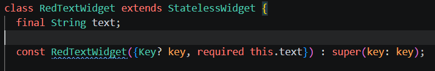

# Laporan Praktikum 07 : Manajemen Plugin

Nama : Yanuar Alda Baran <br>
NIM : 244107060016 <br>
Absen : 21 <br>

## Praktikum Menerapkan Plugin di Project Flutter

### Langkah 1 : Buat Project Baru

Buatlah sebuah project flutter baru dengan nama flutter_plugin_pubdev. Lalu jadikan repository di GitHub Anda dengan nama flutter_plugin_pubdev


### Langkah 2: Menambahkan Plugin
Tambahkan plugin auto_size_text menggunakan perintah berikut di terminal



### Langkah 3: Buat file red_text_widget.dart
Buat file baru bernama red_text_widget.dart di dalam folder lib lalu isi kode seperti berikut.



### Langkah 4: Tambah Widget AutoSizeText
Masih di file red_text_widget.dart, untuk menggunakan plugin auto_size_text, ubahlah kode return Container() menjadi seperti berikut.



Error terjadi karena widget AutoSizeText bukan bagian dari library default Flutter dan belum di-import ke dalam program. Akibatnya, Dart tidak mengenali AutoSizeText sebagai class, melainkan menganggapnya sebagai method yang tidak didefinisikan di dalam class RedTextWidget. Untuk mengatasinya, perlu menambahkan dependency auto_size_text pada file pubspec.yaml dan melakukan import package tersebut ke dalam file Dart.

### Langkah 5: Buat Variabel text dan parameter di constructor
Tambahkan variabel text dan parameter di constructor seperti berikut.



### Langkah 6: Tambahkan widget di main.dart
Buka file main.dart lalu tambahkan di dalam children: pada class _MyHomePageState

```dart
Container(
   color: Colors.yellowAccent,
   width: 50,
   child: const RedTextWidget(
             text: 'You have pushed the button this many times:',
          ),
),
Container(
    color: Colors.greenAccent,
    width: 100,
    child: const Text(
           'You have pushed the button this many times:',
          ),
),

```

Run aplikasi tersebut dengan tekan F5, maka hasilnya akan seperti berikut.


### Tugas Praktikum
1. Selesaikan Praktikum tersebut, lalu dokumentasikan dan push ke repository Anda berupa screenshot hasil pekerjaan beserta penjelasannya di file README.md!

2. Jelaskan maksud dari langkah 2 pada praktikum tersebut!
Langkah 2 bertujuan menambahkan plugin auto_size_text agar aplikasi dapat menggunakan widget AutoSizeText yang mampu menyesuaikan ukuran teks secara otomatis sesuai ruang yang tersedia.

3. Jelaskan maksud dari langkah 5 pada praktikum tersebut!
Langkah 5 bertujuan membuat widget menjadi dinamis dengan menambahkan variabel text dan parameter pada constructor, sehingga widget dapat menerima dan menampilkan teks dari luar (reusable).

4. Pada langkah 6 terdapat dua widget yang ditambahkan, jelaskan fungsi dan perbedaannya!
Pada langkah 6, dua widget digunakan untuk perbandingan: RedTextWidget (AutoSizeText) yang dapat menyesuaikan ukuran teks secara otomatis, dan Text biasa yang tidak memiliki kemampuan tersebut, sehingga bisa terjadi overflow jika ruang terbatas.

5. Jelaskan maksud dari tiap parameter yang ada di dalam plugin auto_size_text berdasarkan tautan pada dokumentasi ini !
Parameter pada AutoSizeText berfungsi untuk mengatur tampilan dan perilaku teks, seperti isi teks (text), gaya (style), jumlah baris (maxLines), batas ukuran font (minFontSize, maxFontSize), serta cara teks menyesuaikan diri terhadap ruang yang tersedia.

6. Kumpulkan laporan praktikum Anda berupa link repository GitHub kepada dosen!